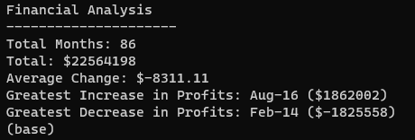
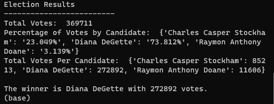

# Module 3: Python Challenge
<ins>Project Overview</ins>

This first deliverable of this project, *PyBank*, focuses on analyzing the financial records of a company using Python to caluclate each of the following values:
* The total number of months included in the dataset
* The net total amount of "Profit/Losses" over the entire period
* The changes in "Profit/Losses" over the entire period, and then the average of those changes
* The greatest increase in profits (date and amount) over the entire period
* The greatest decrease in profits (date and amount) over the entire period

The second ask of this challenge, *PyPoll*, helps a small, rural town modernize its vote-counting process by analyzing the votes and calculates each of the following values:

* The total number of votes cast
* A complete list of candidates who received votes
* The percentage of votes each candidate won
* The total number of votes each candidate won
* The winner of the election based on popular vote

Both of these scripts print the analysis to the terminal and export a text file with the results.

<ins>Processes and Technologies</ins>

*PyBank*
First, I tracked the following variables: total months, net amount of profit/losses, greatest increase in profit (date and amount) and greatest decrease in profit (date and amount) by creating dictionaries for the months and the profits and filling them through a for loop that calculate the change, adds it to list of changes and ultimately calculates the net change over time. The outputs display in the terminal as well as in the 'financialanalysis.txt' file.

*PyPoll*

First, I created the names as a set, candidates as a list and percentages and candidates as a dictionary. Then I opened the csv file and read through the rows using a for loop and added each candidate to the list. If the candidate wasn't already on the list, then the name was added by the if function on line 26. After that, I totaled the votes and found the winner of the election by looking for the max value in the candidate dictionary. I converted the number into a percentage and added the % symbol on line 40. From there, I was able to print the results to the terminal and write the output to a new file titled 'electionresults.txt'.

<ins>Challenges</ins>
I struggled with the syntax of the dictionaries and how to extract the key and value that I wanted. I also consistently forget to start my code by setting the variables to 0 or an empty list etc. Lastly, I could not figure out how to get the analysis txt file to be located in the correct folder by using the code. Eventually, I just moved the files into the correct folder, but that move is not reflected in my code.

Sources:
For this assignment, I worked closely with classmates Saroja Shrestha and Taniya Talukdar. I referenced a Git Hub page for the format of the write portion of both projects and the if statement on line 26 of PyPoll. (I have since lost the direct link, apologies.) Additionally, I used various Slack Overflow articlesand pandas.pydata.org to check my code syntax and solve some of the problems that I ran into with the dictionary.
